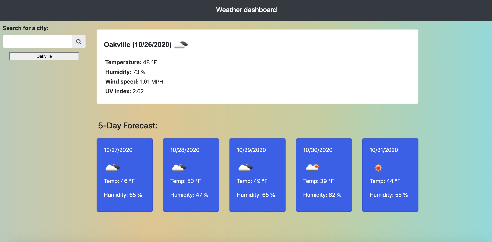

# Weather-dashboard

## Website URL: https://sushmakaluva.github.io/Weather-dashboard/

### Description

* Weather dashboard is a weather application to find current weather conditions and future weather outlook for multiple cities.

### How does it work?
 
* Displays the following under current weather conditions:
 ++ City name
 ++ Date
 ++ Temperature
 ++ Humidity
 ++ Wind speed
 ++ UV Index
 ++ Weather icon
* It has a search history so that users can access their past search terms. Clicking on the city name should perform a new search that returns current and future conditions for that city.
* Includes a 5-Day Forecast for the cities
* Application stores previously searched for cities in localstorage and displays them to the user.
* Application loads last searched city forecast on page load.
* Initial loading of page takes some time to retrieve the current city weather conditions.

### Technologies used to build this site:

* HTML5  
* CSS
* Bootstrap
* Javascript
* Jquery
* JSON
* AJAX
* Web - API's : OpenWeather API & Geolocation API
* Local Storage

### Components used to build this quiz:

+ Moment.js library
+ JSON - Stringify and Parse
+ Bootstrap components - containers,buttons,cards,jumbotrons
+ Bootstrap grids - rows and columns 
+ Javascript functions
+ Local Storage variables
+ Strings, Arrays, Loops, Objects

